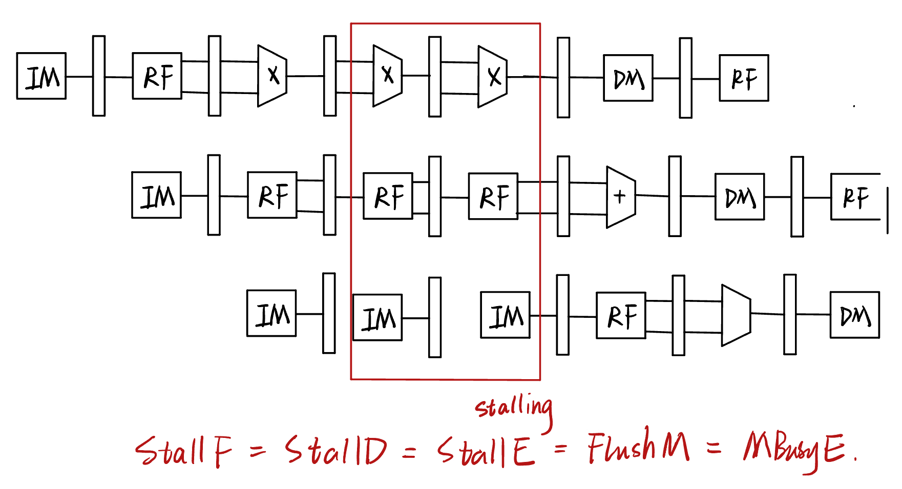
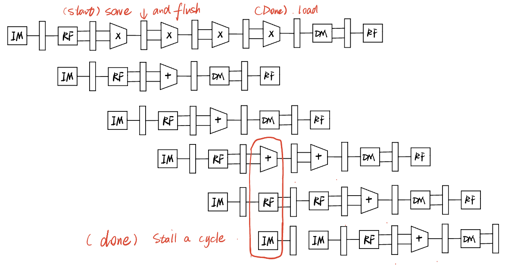
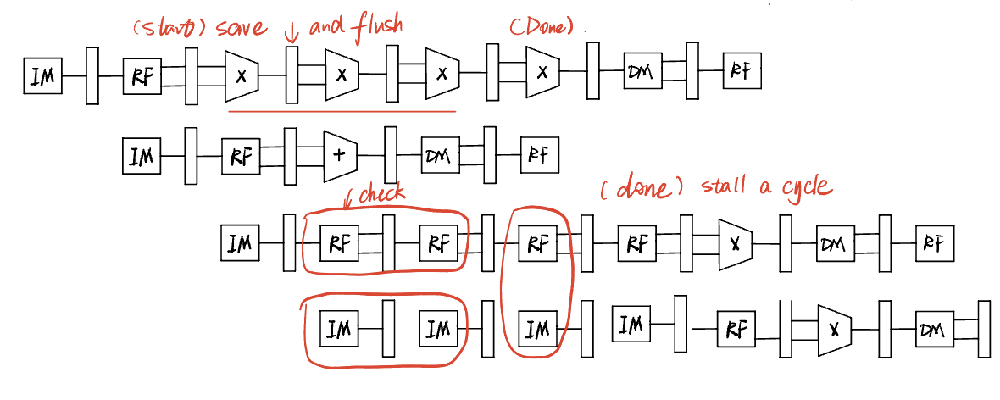

## SME309_Final Project

> **Group Member:** Yupeng Su, Guanqi Peng, Xu Si, Runsen Zhang.
>
> **Date:** 2023 Fall
>
> **About the report:** 
>
> There is no fixed structure for the report. However, to distinguish the understanding level of each group, you should try to show your critical thinking in hardware design and details of each task clearly in your report. By the way, your report should be well-formatted. Division of labor and contribution percentage for each group member should be included at the end of the report. 
>
>  **Submitted Files:** 
>
> 1. Report pdf (including waveform screenshot for each task, on-board result);
> 2. Source code ZIP (including RTL files, assembly code files, test instructions, and so on);
> 3. testbench files for each task;
> 4. constraint file for on-board validation;
> 5. other files…
>
>  **DDL:** 2024/01/19 23:55 PM

### 1. Implement a five-stage pipeline processor with Hazard Unit. 

#### Requirement: 

In this project, you will implement a five-stage pipeline processor that Prof. Lin has shown in the lecture based on the single-cycle processor you’ve implemented in Lab2. The structure is shown below. Take care of data hazards (data forwarding, stall, flush) and control hazards (early BTA, flush).

#### Implement Workflow:

**FINISHED: Yupeng Su**

1. **ADD Module** `HazardUnit`

   * Forward Signal: 

     `ForwardAE`, `ForwardBE` used to handle data harzard for DP instruction.

     `ForwardM` used to andle data harzard for Men instruction.

   * Stall_Flush Signal: `StallF`, `StallD`, `StallE`, `FlushD`,  `FlushE`, `FlushM`.

     1. Stalling for Load and Use: **Insert NOPs** to wait for load instructions.
     2. Stalling for Branch: **Replace NOPs** to clear instructions before branch jump.
     3. Stalling for MCycle: **Insert NOPs** to wait for MultiCycle MUL/DIV.

2. **Change `ARM.v` Structure (Divide to 5 Block)** 

3. **ADD Module `Mcycle` into Pipelined Processor (Keep consistence with Lab3)**

   The two works are concluded as the figure shown below:

   

4. **Change Control Signal `M_busy` Path for Stalling Pipeline (More improvement in 2.)** 

   
   
   $$ \text{StallF = StallD = StallE = FulshM = MBusyE} $$

#### Test & Simulation:

**TODO: Xu Si **

1. Test for Data Forwarding of DP instructions

   - The assembly instructions are as below:

   ```assembly
   LDR R1, constant1; R1=5
   LDR R2, constant2; R2=6
   LDR R9, constant3; R9=3
   
   ADD R5, R1, R2
   SUB R6, R5, R9
   ADD R7, R1, R5
   SUB R8, R5, R2
   
   constant1
   		DCD 0x00000005; 
   constant2
   		DCD 0x00000006;
   constant3 
   		DCD 0x00000003;
   ```

   - The simulation waveform is 

     

     From the change of ForwardAE and ForwardBE, we can see that DataForwarding of DP is valid.

2. Test for Memory-memory copy

   - The assembly instructions are as below:

   ```assembly
   LDR R1, constant1; R1=5
   LDR R2, constant2; R2=6
   LDR R3, addr1; 810
   LDR R4, addr2; 820
   ADD R5, R1, R2; R5 = a1 + a2
   
   ADD R5, R1, R2
   STR R5, [R3,#4];
   ADD R3, R3, #8;
   LDR R6, [R3,#-4]; R6 = 11;
   STR R6, [R4,#4]
   ```

   - The simulation waveform is 

     
     
     When memory-memory copy happens, ForwardM should be 1, which is consistent with the waveform. Therefore,  the code implementation is valid.

3. Test for Load and Use

   - The assembly instructions are as below:

     ```assembly
     LDR R1, constant1; R1=5
     LDR R2, constant2; R2=6
     LDR R9, constant3; R9=3
     LDR R3, addr1; 810
     LDR R4, addr2; 820
     LDR R12,addr3; 830
     
     ADD R5, R1, R2
     STR R5, [R3,#4];
     ADD R3, R3, #8;
     LDR R6, [R3,#-4]; R6 = 11;
     SUB R7, R6, R1
     
     addr1
     		DCD 0x00000810;
     addr2 	
     		DCD 0x00000820;
     addr3
     		DCD 0x00000830;
     constant1
     		DCD 0x00000005; 
     constant2
     		DCD 0x00000006;
     constant3 
     		DCD 0x00000003;
     number0
     		DCD 0x00000000;
     
     
     ```

   - The simulation waveform is 

     

     When Load and Use happens, Idrstall = StallF = StallD = 1. And from the waveform, we can see there is one more cycle between LDR instruction and SUB instruction.

4. Test for EarlyBTA

   - The assembly instructions are as below:

     ```assembly
     LDR R1, constant1; R1=5
     LDR R2, constant2; R2=6
     LDR R9, constant3; R9=3
     LDR R3, addr1; 810
     LDR R4, addr2; 820
     LDR R12,addr3; 830
     
     ;B   2C (The jump instrucrtion is coded in warpper directly)
     AND R5, R1, R2
     ORR R6, R9, R1
     SUB R7, R2, R9
     SUB R8, R2, R1
     ADD R10, R9, R1
     ADD R11, R2, R1
     
     addr1
     		DCD 0x00000810;
     addr2 	
     		DCD 0x00000820;
     addr3
     		DCD 0x00000830;
     constant1
     		DCD 0x00000005; 
     constant2
     		DCD 0x00000006;
     constant3 
     		DCD 0x00000003;
     number0
     		DCD 0x00000000;
     ```

   - The simulation waveform is 

     

     When EarlyBTA happens, PCSrc = FlushD = FlushE = 1. And from the waveform, we can see the branch instruction really happens in advance.

5. Test for multiple DP instructions

   - The assembly instructions are as below:

     ```assembly
     LDR R1, constant1; R1=5
     LDR R2, constant2; R2=6
     LDR R3, addr1; 810
     LDR R4, addr2; 820
     LDR R12,addr3; 830
     ADD R5, R1, R2; R5 = a1 + a2;
     
     SUB R6, R2, R1;  R6 = 1;
     STR R6, [R4,#-4];
     SUB R4, R4, #8;
     LDR R6,[R4,#4];	 R6 = 1;
     
     MUL R7,R5,R2;R7=66
     LDR R8,constant3; R8=3
     LDR R3,number0;R3=0
     MULEQ R7,R1,R8; not execute,R7=66
     ADDS R3,R3,#0; SET Z FLAG = 1
     MULEQ R10,R1,R8; R10=15;
     ADDS R10,R10,R7; R10 =66+15=81,flags are 0
     
     ;The divide instructions are completed in the wrapper directly.
     ADD R3,R3,#0;;DIV R7,R7,R8; R7=66/3=22
     ADD R3,R3,#0;;DIV R7,R7,R1; R7=22/5=4
     ADD R3,R3,#0;;DIVEQ R7,R2,R8; not execute, R7 = 4
     ADDS R3,R3,#0; SET Z FLAG = 1
     ADD R3,R3,#0;;DIVEQ R11,R2,R8;R11=6/3=2;
     ADD R11,R11,R7; R11=2+4=6
     ADD R11,R11,R10;R11=81+6=87=0X0000 0057
     ```

   - The simulation waveform is

     
     
     According to the assemble instructions, the final result of SEVENSEG is 57 in  hexadecimal, which is consistent with the waveform.

### 2. Non-stalling CPU for multi-cycle instructions. 

#### Requirement: 

When a multi-cycle instruction (e.g. MUL instruction) is executed, the CPU should execute the next instructions (instead of stalling the pipeline) if there is no data dependency between the previous instruction. For example, instruction 1 is

$$ \text{MUL R5, R6, R7} $$
And the next instruction (instruction 2) is 

$$ \text{ADD R1, R2, R3} $$

There is no data dependency between instr2 and instr1. When CPU is executing instr1, it can execute instr2 at the same time. Because Mcycle is an independent module, when it is busy, other parts of CPU can handle other instructions at the same time.

However, if instruction 2 is

$$ \text{ADD R1, R5, R3} $$

The data dependency between instr2 and instr1 appears, since the CPU need the result of instruction 1 to execute instruction 2, the pipeline may need to stall until the instruction 1 is done.

#### Implement Workflow:

**FINISHED: Yupeng Su**

1. **Add module `McycleReg` :** 

   **Save** signals of E stage to M stage when **M_start** posedge; (Pause MUL/DIV in Pipline)

   **Load** signals of E stage to M stage when **M_done** posedge; (Recover MUL/DIV in Pipline)

   To avoid latch, I changed the combinatorial logic to a sequential logic implementation same as `RegisterFile`, using **CLK negedge** change the registers.

2. **Remove signal M_write :** 

   **M_write** used to control the OpResult Multiplexer. With module `McycleReg` we can easily choose OpResult by signal **M_done**. Only when Mcycle works done, the OpResult will be assigned to **MCycleResult**,  and **ALUResult** is assigned in all other cases.

3. **Change Stall & Flush Logic (Update HazardUnit):**

   * When **no data dependency**:

     

     * As **M_Start** posedge, **save signals to registers** and **flush M stage** (Waiting result)

       $$ \text{FlushM = MStart} $$

     * As **M_Done** posedge, **recover signals** and **stall E stage** (Write result)

       $$ \text{StallF = StallD = StallE = MDone} $$

     

   * When **data dependency** :

     

     * Case1: Read After Write (R symbols the saved registers in MCycleReg)
       
       $$ \text{RMatch\_12D\_R = (RA1D == WA3R) || (RA2D == WA3R)} $$

     * Case2: Write After Write
       
       $$ \text{WMatch\_3D\_R = (WA3D == WA3R)} $$
       
     * Case3: Same MCycle Op
       $$ \text{M\_StartD}
       $$
     
     * Combine all cases (Stall D stage)
       
       $$ \text{MCycleStall = (RMatch | WMatch | M\_StartD ) \& M\_Busy} $$
       
       $$ \text{StallF = StallD = FlushE = MCycleStall} $$
       
     * Also do same flush&stall as **no data dependency**.

#### Test & Simulation:

**TODO: Xu Si**

1. Test for non-stalling situation, that is  the target register of the first  multiplication or divide instruction is different from the source register of the next DP instruction.

   - The assembly instructions are as below:

     ```assembly
     LDR R1, constant1; R1=5
     LDR R2, constant2; R2=6
     
     MUL R5, R1, R2
     ADD R6, R2, R9
     
     addr1
     		DCD 0x00000810;
     addr2 	
     		DCD 0x00000820;
     addr3
     		DCD 0x00000830;
     constant1
     		DCD 0x00000005; 
     constant2
     		DCD 0x00000006;
     constant3 
     		DCD 0x00000003;
     number0
     		DCD 0x00000000;
     ```

   - The simulation waveform is

     
     
     Since there is not RAW, there is no stalling. The final result in R5 is 1e in hexadecimal, just like what the waveform shows.

2. Test for stalling situation, that is  the target register of the first  multiplication or divide instruction is same as one of the source registers of the next DP instruction.

   - The assembly instructions are as below:

     ```assembly
     LDR R1, constant1; R1=5
     LDR R2, constant2; R2=6
     
     MUL R5, R1, R2
     ADD R6, R5, R9
     
     addr1
     		DCD 0x00000810;
     addr2 	
     		DCD 0x00000820;
     addr3
     		DCD 0x00000830;
     constant1
     		DCD 0x00000005; 
     constant2
     		DCD 0x00000006;
     constant3 
     		DCD 0x00000003;
     number0
     		DCD 0x00000000;
     ```

   - The simulation waveform is

     
     
     Since there exists RAW, there is stall. When stalling happens, FlushE = StallD = StallF = 1, which is consistent with the waveform. Therefore, the stalling situation is achieved successfully.

### 3. Expand the ARM processor to support all the 16 Data Processing Instructions.

#### Requirement: 

You will expand the ARM processor to support **all 16 Data Processing Instructions.** See Section “A3.4 Data-processing instructions” on pages A3-9 to A3-11 of the ARM Architecture Reference Manual for the details of the instructions. Page A3-11 has links to Section 4.xx where the instruction behavior is explained in more detail. 

1. Implement it in the same way as you implemented other DP instructions such as ADD and SUB in Lab2.
2. It mainly involves modifying the ALU and ALU decoder in the Control Unit.
3. The C flag has to be the output port of the CondiLogic module, to act as an input to the ALU module (to support the **ADC** instruction)
4. Implement it hardware efficiently, hopefully without additional adders.

#### Implement Workflow:

**TODO: Runsen Zhang, Guanqi Peng**

#### Test & Simulation:

Create your testbench and assembly code to verify these functions in the **simulation waveform**.

### 4. A 4-way set associative cache between memory and ARM CPU. 

#### Requirement: 


The schematic of a **4-way set associative cache** is shown above. The cache size is **4KB** (256 rows\*4 ways\*4 bytes). The cache uses **write-allocate** and **write-back** scheme. Inserting this cache will further add complexity to the Store and Load instructions. There are 4 situations when accessing the cache:

1. When **read hit**, directly load data from cache to register.
2. When **read miss**, load data from memory to cache, then load data from cache to register.
3. When **write hit**, write to cache only, but set the block dirty, write back to memory when dirty data is replaced. (write-back strategy)
4. When **write miss**, if the block is dirty, write the dirty block to memory, and load the data to replace the cache (write-allocate); if not dirty, directly write to memory, and cache load this data.

#### Implement Workflow:

**TODO: Yupeng Su** 

#### Test & Simulation:

Create your testbench and assembly code to verify these functions in the **simulation waveform**.

### 6. Floating-point Unit

#### Requirement: 

Add a Floating processing unit (FPU) in your pipelined ARM CPU to support simple floating-point processing instructions: 

1. Single Float Addition (**FADD**);
2. Single Float Multiplication (**FMUL**).

#### Implement Workflow:

**TODO: Guanqi Peng**

Additionally, you should show the design ideas (such as “How to deal with Not a Number(NaN) in float?”) and the details of your design in your report.

#### Test & Simulation:

The assembly instructions are as below:	

```assembly
LDR R1, constant4;
LDR R2, constant5;
LDR R3, constant6;
LDR R4, constant7;
	
MUL R5, R3, R2;
MUL R6, R3, R4;
MUL R7, R1, R3;
	
DIV R8, R4, R3;

addr1
		DCD 0x00000810;
addr2 	
		DCD 0x00000820;
addr3
		DCD 0x00000830;
constant1
		DCD 0x00000005; 
constant2
		DCD 0x00000006;
constant3 
		DCD 0x00000003;			
constant4 
		DCD 0x42400000;48.0
constant5 
		DCD 0x40A00000;5.0
constant6
		DCD 0x3FA66666;1.3
constant7
		DCD 0x40266666;2.6		
number0
		DCD 0x00000000;

```

​	The simulation waveform is


The first three "MUL" instructions are Single Float Addition. The last "DIV" instruction is Single Float Multiplication. The result of the waveform is consistent with the  Calculation results.

When there exist special cases, such as $NaN, \infin, -\infin, 0$, the CPU will process this like below:

The assembly instructions:

```assembly
LDR R1, constant4;
LDR R2, constant5;
LDR R3, constant6;
LDR R4, constant7;
LDR R5, constant8;
		
MUL R6, R1, R2;
MUL R7, R1, R3;
MUL R8, R1, R4;
MUL R9, R1, R5;
	
DIV R6, R1, R2;
DIV R7, R1, R3;
DIV R8, R1, R4;
DIV R9, R1, R5;

constant4 
		DCD 0x3FA66666;1.3
constant5 
		DCD 0x00000000;0.0
constant6
		DCD 0x7F800000;infinite
constant7
		DCD 0xFF800000;Neg infinite
constant8
		DCD 0xFFFFFFFF;NaN
```

The simulation waveform is


From the waveform we can see that the processor deal with special cases according to the Arm manual.

### 7. RISC-V ISA 

#### Requirement: 

Implement a **single-cycle** CPU core to support simple RISC-V ISA. Your design should support basic instructions in **RV32I** extension (Refer to RISC-V reference manual for more details). **RV32I** is the minimal implementation for a RISC-V CPU, we only need to implement 3 parts of **RV32I**:

1. **Integer computational** instructions;
2. **Load and store** instructions;
3. **Control transfer** instructions. 

#### Implement Workflow:

Additionally, you can try to find the differences between ARM and RISC-V hardware architecture, and explain them in your report.

#### Test & Simulation:

Test your design by writing an assembly program yourself, which should contain all kinds of these instructions. 

### 8. Advanced Processor (Bonus)

#### Requirement: 

There are some advanced method to further improve the performance of a processor. In this project, you can try to implement some of these functions, test and explain in your report.

1. Dynamic Branch Prediction
2. Multiple-Issue (Superscalar)
3. Out-of-Order Execution
4. Interrupt (Exception handler)
5. ……

**Note: The bonus is hard and takes lots of time, mostly for fun.**