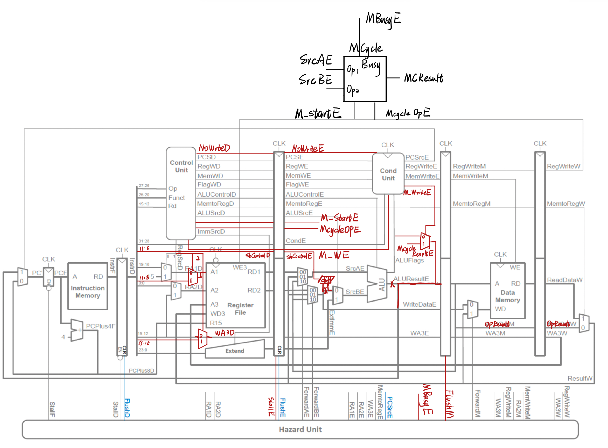
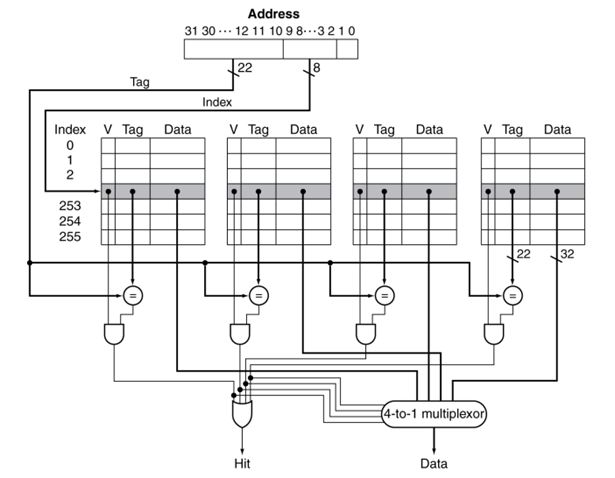

## SME309_Final Project

> **Group Member:** Yupeng Su, Guanqi Peng, Xu Si, Runsen Zhang.
>
> **Date:** 2023 Fall
>
> **About the report:** 
>
> There is no fixed structure for the report. However, to distinguish the understanding level of each group, you should try to show your critical thinking in hardware design and details of each task clearly in your report. By the way, your report should be well-formatted. Division of labor and contribution percentage for each group member should be included at the end of the report. 
>
>  **Submitted Files:** 
>
> 1. Report pdf (including waveform screenshot for each task, on-board result);
> 2. Source code ZIP (including RTL files, assembly code files, test instructions, and so on);
> 3. testbench files for each task;
> 4. constraint file for on-board validation;
> 5. other files…
>
>  **DDL:** 2024/01/19 23:55 PM

### 1. Implement a five-stage pipeline processor with Hazard Unit. 

#### Requirement: 

In this project, you will implement a five-stage pipeline processor that Prof. Lin has shown in the lecture based on the single-cycle processor you’ve implemented in Lab2. The structure is shown below. Take care of data hazards (data forwarding, stall, flush) and control hazards (early BTA, flush).

#### Implement Workflow:W

**// TODO: Yupeng Su **

#### Test & Simulation:

Create your testbench and assembly code to verify these functions in the **simulation waveform**.

### 2. Non-stalling CPU for multi-cycle instructions. 

#### Requirement: 

When a multi-cycle instruction (e.g. MUL instruction) is executed, the CPU should execute the next instructions (instead of stalling the pipeline) if there is no data dependency between the previous instruction. For example, instruction 1 is
$$
\text{MUL R5, R6, R7}
$$
And the next instruction (instruction 2) is 
$$
\text{ADD R1, R2, R3}
$$
There is no data dependency between instr2 and instr1. When CPU is executing instr1, it can execute instr2 at the same time. Because Mcycle is an independent module, when it is busy, other parts of CPU can handle other instructions at the same time.

However, if instruction 2 is
$$
\text{ADD R1, R5, R3}
$$
The data dependency between instr2 and instr1 appears, since the CPU need the result of instruction 1 to execute instruction 2, the pipeline may need to stall until the instruction 1 is done.

#### Implement Workflow:

#### Test & Simulation:

Create your testbench and assembly code to verify these functions in the **simulation waveform**.

### 3. Expand the ARM processor to support all the 16 Data Processing Instructions.

#### Requirement: 

You will expand the ARM processor to support **all 16 Data Processing Instructions.** See Section “A3.4 Data-processing instructions” on pages A3-9 to A3-11 of the ARM Architecture Reference Manual for the details of the instructions. Page A3-11 has links to Section 4.xx where the instruction behavior is explained in more detail. 

1. Implement it in the same way as you implemented other DP instructions such as ADD and SUB in Lab2.
2. It mainly involves modifying the ALU and ALU decoder in the Control Unit.
3. The C flag has to be the output port of the CondiLogic module, to act as an input to the ALU module (to support the **ADC** instruction)
4. Implement it hardware efficiently, hopefully without additional adders.

#### Implement Workflow:

#### Test & Simulation:

Create your testbench and assembly code to verify these functions in the **simulation waveform**.

### 4. A 4-way set associative cache between memory and ARM CPU. 

#### Requirement: 

The schematic of a **4-way set associative cache** is shown above. The cache size is **4KB** (256 rows\*4 ways\*4 bytes). The cache uses **write-allocate** and **write-back** scheme. Inserting this cache will further add complexity to the Store and Load instructions. There are 4 situations when accessing the cache:

1. When **read hit**, directly load data from cache to register.
2. When **read miss**, load data from memory to cache, then load data from cache to register.
3. When **write hit**, write to cache only, but set the block dirty, write back to memory when dirty data is replaced. (write-back strategy)
4. When **write miss**, if the block is dirty, write the dirty block to memory, and load the data to replace the cache (write-allocate); if not dirty, directly write to memory, and cache load this data.

#### Implement Workflow:

#### Test & Simulation:

Create your testbench and assembly code to verify these functions in the **simulation waveform**.

### 6. Floating-point Unit

#### Requirement: 

Add a Floating processing unit (FPU) in your pipelined ARM CPU to support simple floating-point processing instructions: 

1. Single Float Addition (**FADD**);
2. Single Float Multiplication (**FMUL**).

#### Implement Workflow:

Additionally, you should show the design ideas (such as “How to deal with Not a Number(NaN) in float?”) and the details of your design in your report.

#### Test & Simulation:

Test your design by writing an assembly program yourself, which should contain all these instructions. 

### 7. RISC-V ISA 

#### Requirement: 

Implement a **single-cycle** CPU core to support simple RISC-V ISA. Your design should support basic instructions in **RV32I** extension (Refer to RISC-V reference manual for more details). **RV32I** is the minimal implementation for a RISC-V CPU, we only need to implement 3 parts of **RV32I**:

1. **Integer computational** instructions;
2. **Load and store** instructions;
3. **Control transfer** instructions. 

#### Implement Workflow:

Additionally, you can try to find the differences between ARM and RISC-V hardware architecture, and explain them in your report.

#### Test & Simulation:

Test your design by writing an assembly program yourself, which should contain all kinds of these instructions. 

### 8. Advanced Processor (Bonus)

#### Requirement: 

There are some advanced method to further improve the performance of a processor. In this project, you can try to implement some of these functions, test and explain in your report.

1. Dynamic Branch Prediction
2. Multiple-Issue (Superscalar)
3. Out-of-Order Execution
4. Interrupt (Exception handler)
5. ……

**Note: The bonus is hard and takes lots of time, mostly for fun.**