## SME309_Final Project

> **Group Member:** Yupeng Su, Guanqi Peng, Xu Si, Runsen Zhang.
>
> **Date:** 2023 Fall
>
> **About the report:** 
>
> There is no fixed structure for the report. However, to distinguish the understanding level of each group, you should try to show your critical thinking in hardware design and details of each task clearly in your report. By the way, your report should be well-formatted. Division of labor and contribution percentage for each group member should be included at the end of the report. 
>
>  **Submitted Files:** 
>
> 1. Report pdf (including waveform screenshot for each task, on-board result);
> 2. Source code ZIP (including RTL files, assembly code files, test instructions, and so on);
> 3. testbench files for each task;
> 4. constraint file for on-board validation;
> 5. other files…
>
>  **DDL:** 2024/01/19 23:55 PM

### 1. Implement a five-stage pipeline processor with Hazard Unit. 

#### Requirement: 

In this project, you will implement a five-stage pipeline processor that Prof. Lin has shown in the lecture based on the single-cycle processor you’ve implemented in Lab2. The structure is shown below. Take care of data hazards (data forwarding, stall, flush) and control hazards (early BTA, flush).

#### Implement Workflow:

**FINISHED: Yupeng Su**

1. **ADD Module** `HazardUnit`

   * Forward Signal: 

     `ForwardAE`, `ForwardBE` used to handle data harzard for DP instruction.

     `ForwardM` used to andle data harzard for Men instruction.

   * Stall_Flush Signal: `StallF`, `StallD`, `StallE`, `FlushD`,  `FlushE`, `FlushM`.

     1. Stalling for Load and Use: **Insert NOPs** to wait for load instructions.
     2. Stalling for Branch: **Replace NOPs** to clear instructions before branch jump.
     3. Stalling for MCycle: **Insert NOPs** to wait for MultiCycle MUL/DIV.

2. **Change `ARM.v` Structure (Divide to 5 Block)** 

3. **ADD Module `Mcycle` into Pipelined Processor (Keep consistence with Lab3)**

   The two works are concluded as the figure shown below:

   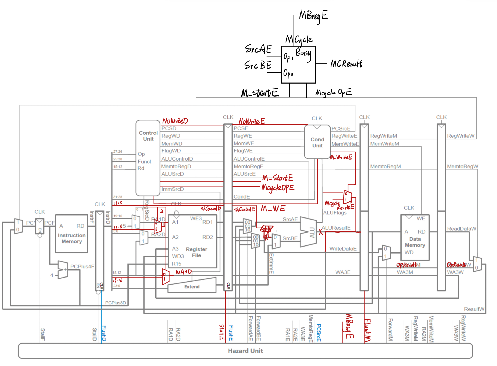

4. **Change Control Signal `M_busy` Path for Stalling Pipeline (More improvement in 2.)** 

   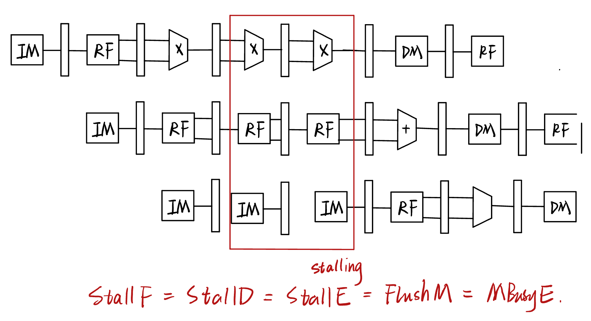
   
   $$ \text{StallF = StallD = StallE = FulshM = MBusyE} $$

#### Test & Simulation:

**TODO: Xu Si **

1. Test for Data Forwarding of DP instructions

   - The assembly instructions are as below:

   ```assembly
   LDR R1, constant1; R1=5
   LDR R2, constant2; R2=6
   LDR R9, constant3; R9=3
   
   ADD R5, R1, R2
   SUB R6, R5, R9
   ADD R7, R1, R5
   SUB R8, R5, R2
   
   addr1
   		DCD 0x00000810;
   addr2 	
   		DCD 0x00000820;
   addr3
   		DCD 0x00000830;
   constant1
   		DCD 0x00000005; 
   constant2
   		DCD 0x00000006;
   constant3 
   		DCD 0x00000003;
   ```

   - The simulation waveform is 

     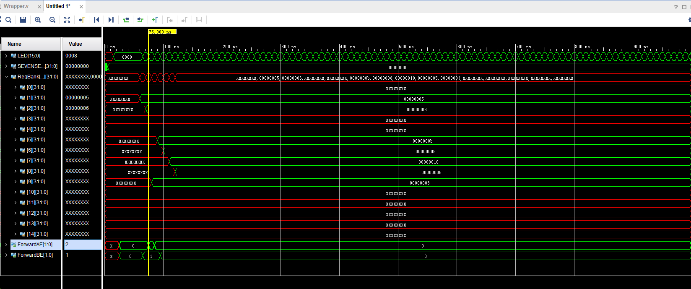

     From the change of ForwardAE and ForwardBE, we can see that DataForwarding of DP is valid.

   - The on-board test figure is

     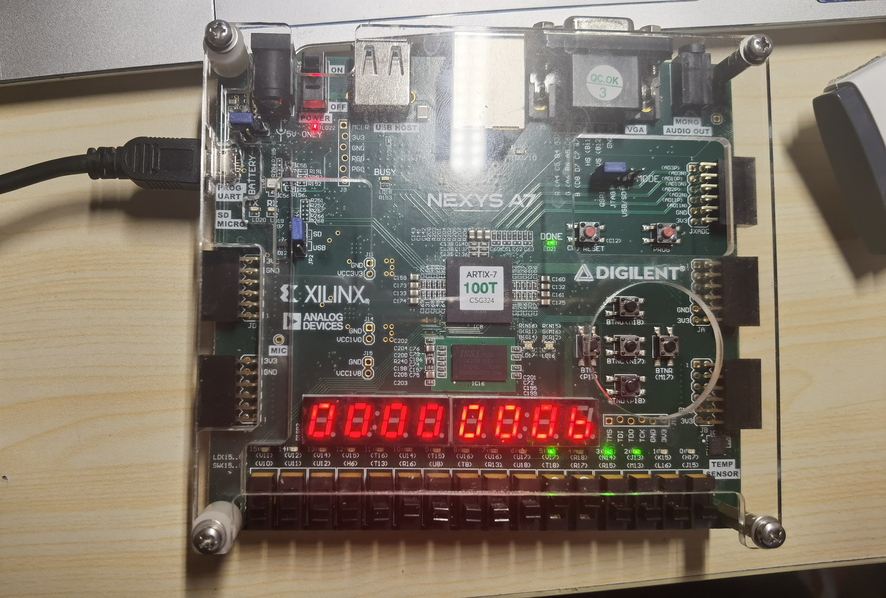 

2. Test for Memory-memory copy

   - The assembly instructions are as below:

   ```assembly
   LDR R1, constant1; R1=5
   LDR R2, constant2; R2=6
   LDR R3, addr1; 810
   LDR R4, addr2; 820
   ADD R5, R1, R2; R5 = a1 + a2
   
   ADD R5, R1, R2
   STR R5, [R3,#4];
   ADD R3, R3, #8;
   LDR R6, [R3,#-4]; R6 = 11;
   STR R6, [R4,#4]
   ```

   - The simulation waveform is 

     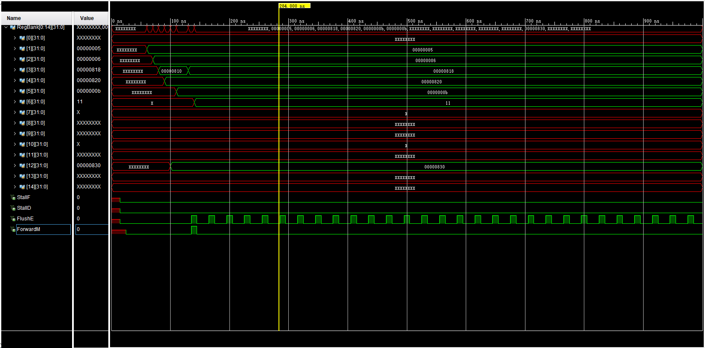
     
     When memory-memory copy happens, ForwardM should be 1, which is consistent with the waveform. Therefore,  the code implementation is valid.

   - The on-board test figure is

     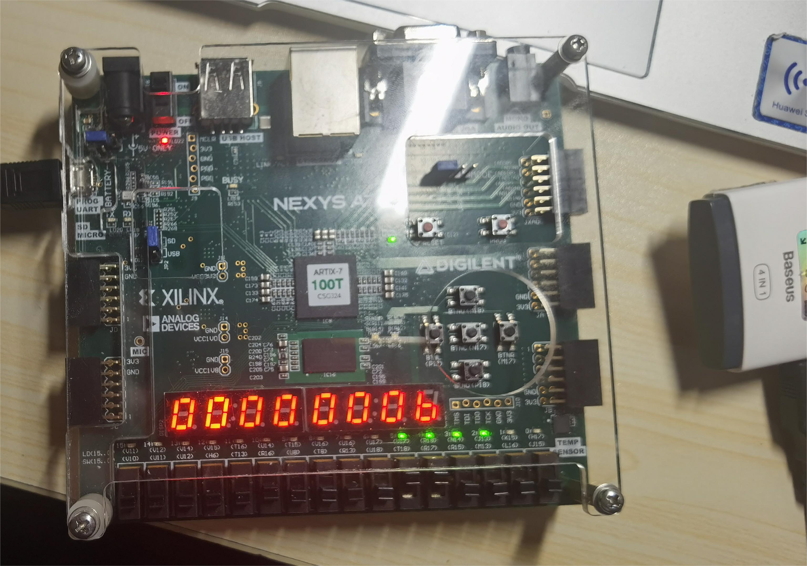 

3. Test for Load and Use

   - The assembly instructions are as below:

     ```assembly
     LDR R1, constant1; R1=5
     LDR R2, constant2; R2=6
     LDR R9, constant3; R9=3
     LDR R3, addr1; 810
     LDR R4, addr2; 820
     LDR R12,addr3; 830
     
     ADD R5, R1, R2
     STR R5, [R3,#4];
     ADD R3, R3, #8;
     LDR R6, [R3,#-4]; R6 = 11;
     SUB R7, R6, R1
     ```
     
   - The simulation waveform is 
   
     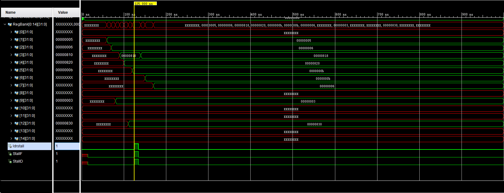

     When Load and Use happens, Idrstall = StallF = StallD = 1. And from the waveform, we can see there is one more cycle between LDR instruction and SUB instruction.

   - The on-board test figure is

     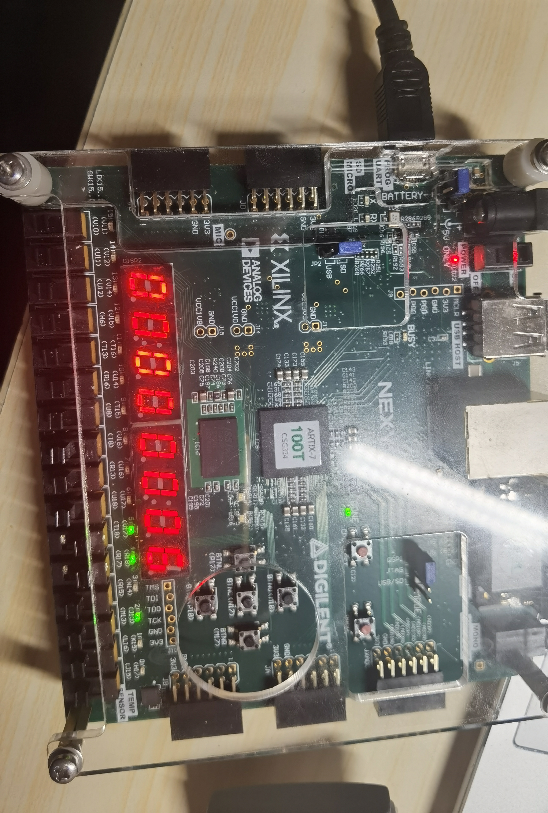 
   
4. Test for EarlyBTA

   - The assembly instructions are as below:

     ```assembly
     LDR R1, constant1; R1=5
     LDR R2, constant2; R2=6
     LDR R9, constant3; R9=3
     LDR R3, addr1; 810
     LDR R4, addr2; 820
     LDR R12,addr3; 830
     
     ;B   2C (The jump instrucrtion is coded in warpper directly)
     AND R5, R1, R2
     ORR R6, R9, R1
     SUB R7, R2, R9
     SUB R8, R2, R1
     ADD R10, R9, R1
     ADD R11, R2, R1
     ```
     
   - The simulation waveform is 
   
     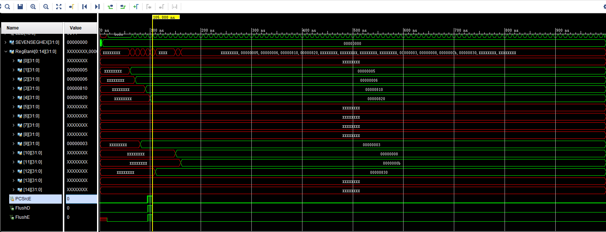
   
     When EarlyBTA happens, PCSrc = FlushD = FlushE = 1. And from the waveform, we can see the branch instruction really happens in advance.
   
   - The on-board test figure is

     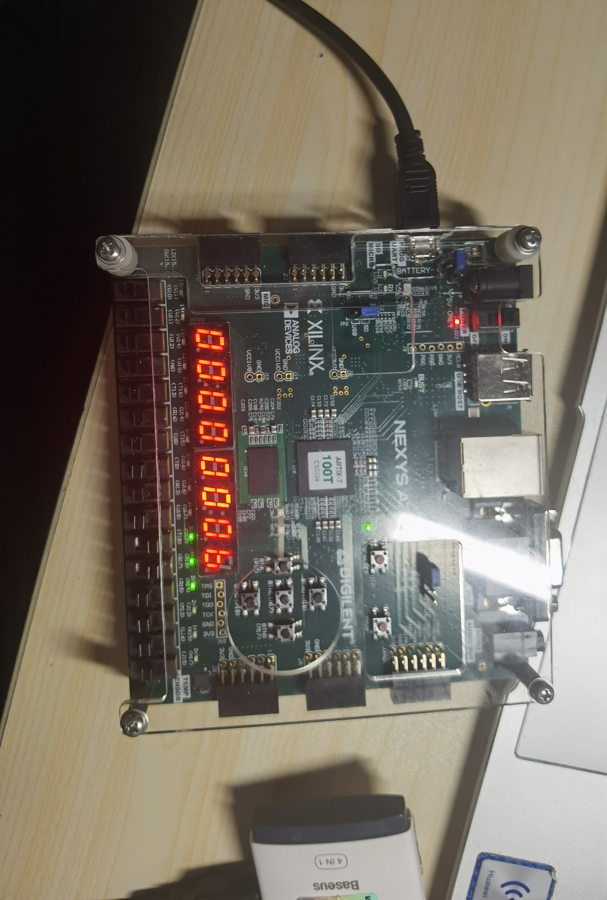 
     
5. Test for multiple DP instructions

   - The assembly instructions are as below:

     ```assembly
     LDR R1, constant1; R1=5
     LDR R2, constant2; R2=6
     LDR R3, addr1; 810
     LDR R4, addr2; 820
     LDR R12,addr3; 830
     ADD R5, R1, R2; R5 = a1 + a2;
     
     SUB R6, R2, R1;  R6 = 1;
     STR R6, [R4,#-4];
     SUB R4, R4, #8;
     LDR R6,[R4,#4];	 R6 = 1;
     
     MUL R7,R5,R2;R7=66
     LDR R8,constant3; R8=3
     LDR R3,number0;R3=0
     MULEQ R7,R1,R8; not execute,R7=66
     ADDS R3,R3,#0; SET Z FLAG = 1
     MULEQ R10,R1,R8; R10=15;
     ADDS R10,R10,R7; R10 =66+15=81,flags are 0
     
     DIV R7,R7,R8; R7=66/3=22
     DIV R7,R7,R1; R7=22/5=4
     DIVEQ R7,R2,R8; not execute, R7 = 4
     ADDS R3,R3,#0; SET Z FLAG = 1
     DIVEQ R11,R2,R8;R11=6/3=2;
     ADD R11,R11,R7; R11=2+4=6
     ADD R11,R11,R10;R11=81+6=87=0X0000 0057
     ```
     
   - The simulation waveform is
   
     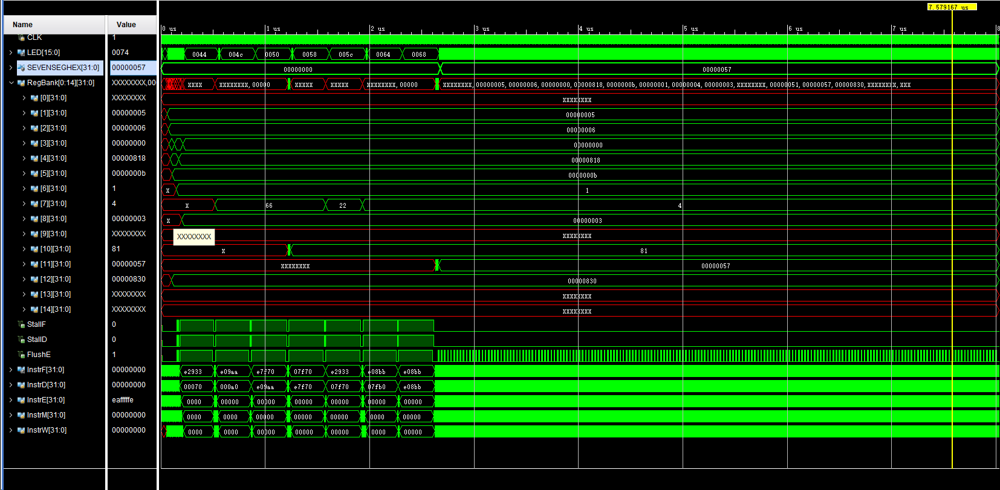
     
     According to the assemble instructions, the final result of SEVENSEG is 57 in  hexadecimal, which is consistent with the waveform.

   - The on-board test figure is

     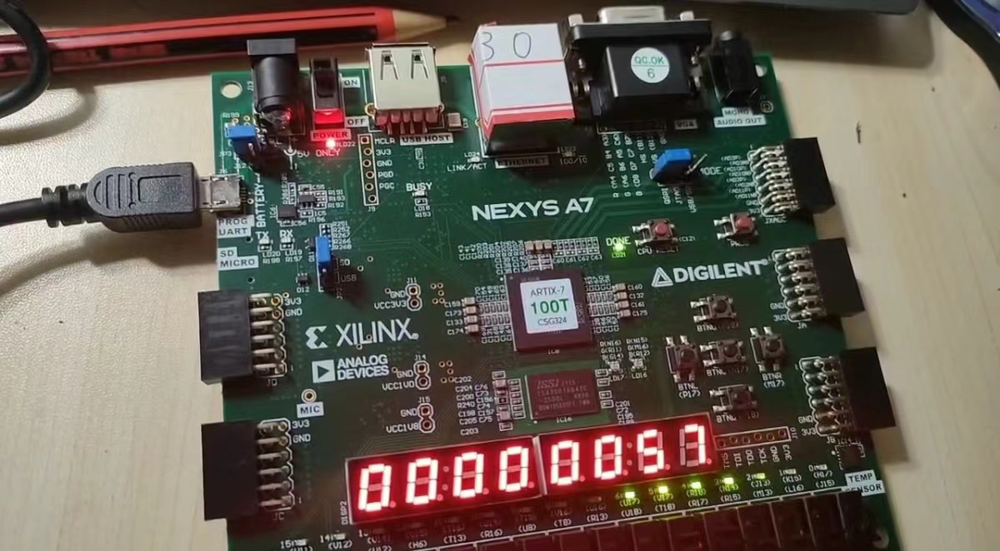 

### 2. Non-stalling CPU for multi-cycle instructions. 

#### Requirement: 

When a multi-cycle instruction (e.g. MUL instruction) is executed, the CPU should execute the next instructions (instead of stalling the pipeline) if there is no data dependency between the previous instruction. For example, instruction 1 is

$$ \text{MUL R5, R6, R7} $$
And the next instruction (instruction 2) is 

$$ \text{ADD R1, R2, R3} $$

There is no data dependency between instr2 and instr1. When CPU is executing instr1, it can execute instr2 at the same time. Because Mcycle is an independent module, when it is busy, other parts of CPU can handle other instructions at the same time.

However, if instruction 2 is

$$ \text{ADD R1, R5, R3} $$

The data dependency between instr2 and instr1 appears, since the CPU need the result of instruction 1 to execute instruction 2, the pipeline may need to stall until the instruction 1 is done.

#### Implement Workflow:

**FINISHED: Yupeng Su**

1. **Add module `McycleReg` :** 

   **Save** signals of E stage to M stage when **M_start** posedge; (Pause MUL/DIV in Pipline)

   **Load** signals of E stage to M stage when **M_done** posedge; (Recover MUL/DIV in Pipline)

   To avoid latch, I changed the combinatorial logic to a sequential logic implementation same as `RegisterFile`, using **CLK negedge** change the registers.

2. **Remove signal M_write :** 

   **M_write** used to control the OpResult Multiplexer. With module `McycleReg` we can easily choose OpResult by signal **M_done**. Only when Mcycle works done, the OpResult will be assigned to **MCycleResult**,  and **ALUResult** is assigned in all other cases.

3. **Change Stall & Flush Logic (Update HazardUnit):**

   * When **no data dependency**:

     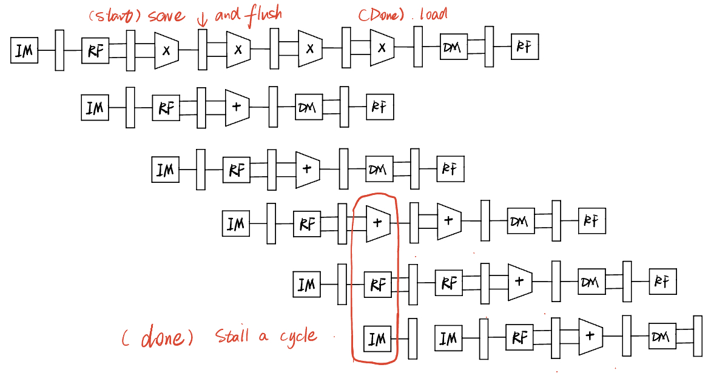

     * As **M_Start** posedge, **save signals to registers** and **flush M stage** (Waiting result)

       $$ \text{FlushM = MStart} $$

     * As **M_Done** posedge, **recover signals** and **stall E stage** (Write result)

       $$ \text{StallF = StallD = StallE = MDone} $$

     

   * When **data dependency** :

     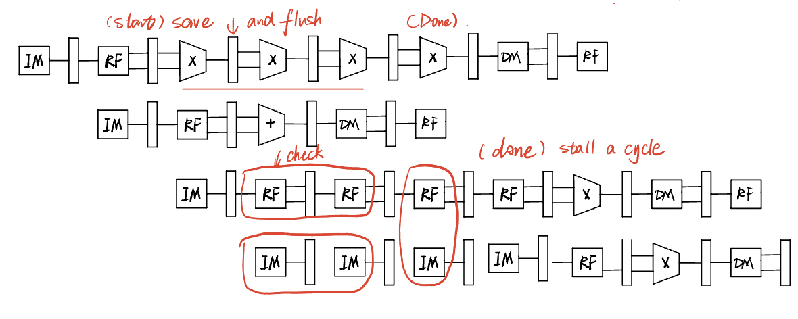

     * Case1: Read After Write (R symbols the saved registers in MCycleReg)
       
       $$ \text{RMatch\_12D\_R = (RA1D == WA3R) || (RA2D == WA3R)} $$

     * Case2: Write After Write
       
       $$ \text{WMatch\_3D\_R = (WA3D == WA3R)} $$
       
     * Case3: Same MCycle Op
       $$ \text{M\_StartD}
       $$
     
     * Combine all cases (Stall D stage)
       
       $$ \text{MCycleStall = (RMatch | WMatch | M\_StartD ) \& M\_Busy} $$
       
       $$ \text{StallF = StallD = FlushE = MCycleStall} $$
       
     * Also do same flush&stall as **no data dependency**.

#### Test & Simulation:

**TODO: Xu Si**

1. Test for non-stalling situation, that is  the target register of the first  multiplication or divide instruction is different from the source register of the next DP instruction.

   - The assembly instructions are as below:

     ```assembly
     LDR R1, constant1; R1=5
     LDR R2, constant2; R2=6
     
     MUL R5, R1, R2
     ADD R6, R2, R9
     ```
     
   - The simulation waveform is
   
     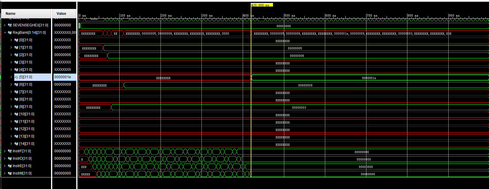
     
     Since there is not RAW, there is no stalling. The final result in R5 is 1e in hexadecimal, just like what the waveform shows.
   
2. Test for stalling situation, that is  the target register of the first  multiplication or divide instruction is same as one of the source registers of the next DP instruction.

   - The assembly instructions are as below:

     ```assembly
     LDR R1, constant1; R1=5
     LDR R2, constant2; R2=6
     
     MUL R5, R1, R2
     ADD R6, R5, R9
     ```
     
   - The simulation waveform is
   
     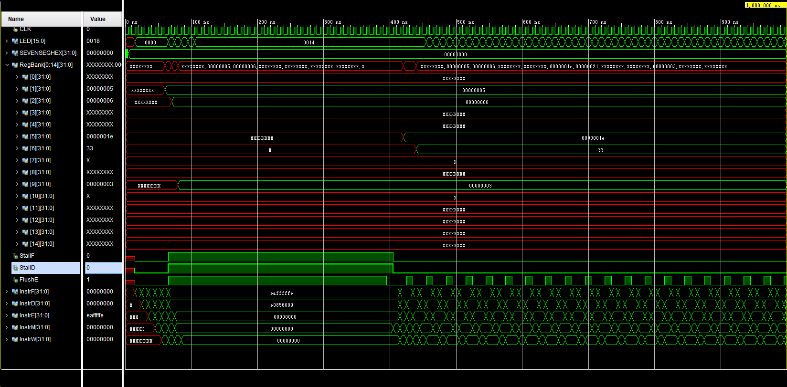
     
     Since there exists RAW, there is stall. When stalling happens, FlushE = StallD = StallF = 1, which is consistent with the waveform. Therefore, the stalling situation is achieved successfully.

   - The on-board test figure is

     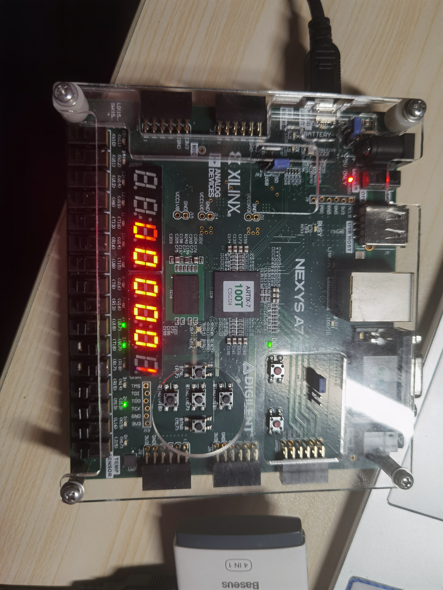 

### 3. Expand the ARM processor to support all the 16 Data Processing Instructions.

#### Requirement: 

You will expand the ARM processor to support **all 16 Data Processing Instructions.** See Section “A3.4 Data-processing instructions” on pages A3-9 to A3-11 of the ARM Architecture Reference Manual for the details of the instructions. Page A3-11 has links to Section 4.xx where the instruction behavior is explained in more detail. 

1. Implement it in the same way as you implemented other DP instructions such as ADD and SUB in Lab2.
2. It mainly involves modifying the ALU and ALU decoder in the Control Unit.
3. The C flag has to be the output port of the CondiLogic module, to act as an input to the ALU module (to support the **ADC** instruction)
4. Implement it hardware efficiently, hopefully without additional adders.

#### Implement Workflow:

**FINISHED: Runsen Zhang**

1. **Add output signal C in CondLogic module:** 

   The original **C** signal, which stands for carry flag, is a part of the four **ALUFlags** that are used to judge whether the flags meet the conditions and the instructions will be executed. It's only used in `CondLogic` module and need no ports as outputs.

   However, when considering implementing all the **16 Data Processing Instructions**, especially **ADC, SBC** and **RSC**, **C** is required in `ALU` module as a part of the arithematic.

2. **Add three output signals  Carry_used, Reverse_B and Reverse_Src in Decoder module :** 

   **Carry_used** is used in `ALU` module to judge whether the **C** signal generated from `CondLogic` module is needed. When the instrucion is one of **ADC,SBC** and **RSC**, **Carry_used** is pulled high.
   **Reverse_B** is also used in `ALU` module to judge if **Src_B** needs to be reversed. **Src_B** is reversed only with the instruction of **BIC** and **MVN**.
   **Reverse_Src** is used in `ARM` module to judge if **Src_A** and **Src_B** need to be exchanged. That is, shifter_operand is the input of **Src_A** while Rn is the input of **Src_B**. This situation appears when either **RSB** or **RSC** is executed.

3. **Extend the bitwidth of signal ALUControl from 2 bits to 3 bits:**
   The original bitwidth of the signal **ALUControl** is 2 bits, which is used as the four conditions of executing And, Or, Add and Sub in `ALU` module respectively.
   Nevertheless, to implement all **Data Processing Instructions**, other arithmetic such as **EOR** and **MOV** should be considered. **EOR** itself is an arithmetic. **MOV** and **MVN** needs the origin and inverse codes of **Src_B** instead of origin and complement of **Src_B** like **SUB** does. Thus, two more conditions of **ALUControl** are required, leading to the extension of bitwidth.
   To satisfy the assignment of all the instructions, the amount of the cases of {ALUOp[1:0],Funct[4:0]} increase to 2+12*2+4 = 30.
   The bitwidth of **ALUControl** needs to be changed in `Decoder`, `ALU` and `ARM` three modules.

4. **Change the computation of ALUResult in ALU module:**
   As mentioned above, the bitwidth of **ALUControl** is extended, leading to two more conditions and changes in the original ways of computing **ALUResult**.
   To implement **ADC, SBC** and **RSC**, **C** signal needs to be considered in the original Add and Sub. Two new signals **Carry_trans** and **Carry_fixed** are used to tell whether **C** signal is used and the way it will be used. Another new signal **Src_B_fixed** is used to tell whether **Src_B** needs to be inversed with the signal **Reverse_B** mentioned above.
   With these changes, the computing of **ALUResult** are divided into the sum of **Src_A,  Src_B** and **Carry_fixed**, the sum of **Src_A**, complement of **Src_B** and complement of **Carry_fixed**, **Src_A** AND **Src_B_fixed**, **Src_A** ORR **Src_B**, **Src_A** EOR **Src_B**, and assigning to **Src_B_fixed** six kinds.

5. **Changes in ARM module:**
   New signals **C**, **Carry_usedD**, **Reverse_BD**, **Reverse_SrcD** as wires and **Carry_usedE**, **Reverse_BE**, **Reverse_SrcE** as regs are introduced in `ARM` module to satisfy the changes in other modules. Besides, the bitwidth of **ALUControlD** and **ALUControlE** increase from 2 to 3 as mentioned above.

#### Test & Simulation:

1. Test for **AND, ORR, EOR** and **MOV**

   - The assembly instructions are as below:

   ```assembly
    LDR R1, constant1; R1=5
    LDR R2, constant2; R2=6
    LDR R3, addr1; 810
    LDR R4, addr2; 820
    LDR R12,addr3; 0xffffffff
    
    AND R5, R1, #1;   R5=1
    AND R6, R2, R3;   R6=0
    EOR R7, R1, R2;   R7=3
    EOR R8, R1, R1;   R8=0
    ORR R9, R1, R2;   R9=7
    MOV R5, #0;       R5=0
    ORR R6, R1, R1;   R6=5
   
    addr1
        DCD 0x00000810;
    addr2 	
        DCD 0x00000820;
    addr3
        DCD 0xffffffff;
    constant1
        DCD 0x00000005; 
    constant2
        DCD 0x00000006;
    constant3 
        DCD 0x00000003;
   ```

   - The simulation waveform is 

     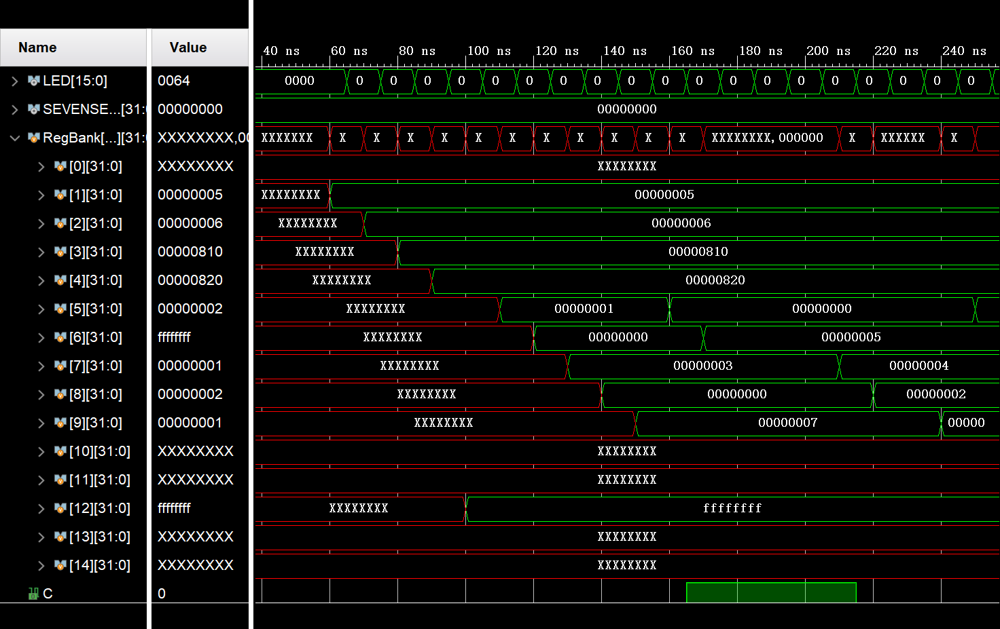

     At 110ns, the output of the first AND instruction is shown in R5. At 170ns, the output of the final ORR instruction is shown in R6. Within this period of time, the outputs of the instructions can be seen, which is all correct.

2. Test for **CMN, TST, TEQ, RSB, ADC, CMP, RSC** and **SBC**.

   - The assembly instructions are as below(the former instructions are the same as part 1, which results in R5=0, R6=5, R7=3, R8=0, R9=7):

     ```assembly

      CMN R2, R12;      R2=6 N=0 Z=0 C=1 V=0
      TST R1, #0;       R1=5 N=0 Z=1
      TEQ R1, #0;       R1=5 N=0 Z=0	
      RSB R7, R7, #7;   R7=4
      ADC R8, R8, #1;   R8=2
      CMP R1, #6;       R1=5 N=1 Z=0 C=0 V=0
      RSC R9, R9, #9;   R9=1
      SBC R5, R1, #2;   R5=2

     ```

   - The simulation waveform is

     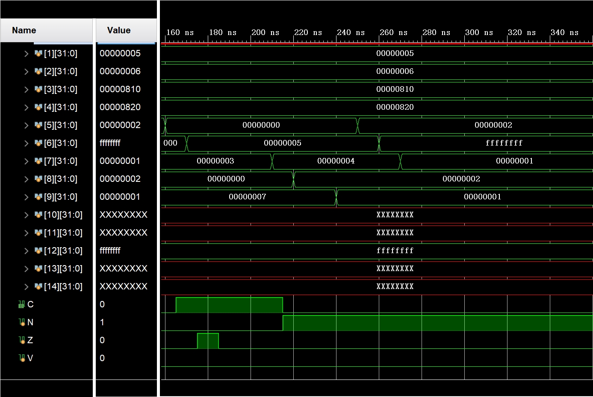
     
     At 165ns, **C**, one of the ALUFlags is pulled up to 1 since **CMN** instruction has come into exection stage. At 175ns, **TST** has come into execution stage and changes the **Z** flag to 1. At 185ns, **TEQ** has come into execution stage and the **Z** flag is pulled down to 0. **TST** and **TEQ** do not change **C** flag and **V** flag, which makes the **C** flag from 165ns to 215ns maintaining to be 1 until **CMP** instruction has come into exectuion stage at 215ns. At 210ns, the output of **RSC** instruction is shown in R7, which is shifter_operand 7 minus the original value of R7 3 equals 4, which is correct in the waveform. Since **C** flag is 1, the Carry signal of the **ADC** instruction is pulled up, resulting in the value of R8 being 0+1+1=2 shown in the waveform at 220ns. **CMP** comes into exection stage at 215ns and changes **C** and **N** flags as mentioned above. Since **C** becomes 0 at 215ns, the NOT Carry signals of **RSC** and **SBC** are pulled up, resulting in the value of R9 being 9-7-1=1 and R5 beign 5-2-1=2 shown in the waveform at 240ns and 250ns.

3. Test for **MVN** and **BIC**.

   - The assembly instructions are as below(the former instructions are the same as part 1 and part 2, which results in R5=2, R6=5, R7=4, R8=2, R9=1):

     ```assembly

      MVN R6, #0;       R6=0xffffffff
	  BIC R7, R1, #4;   R7=1

     ```

   - The simulation waveform is

     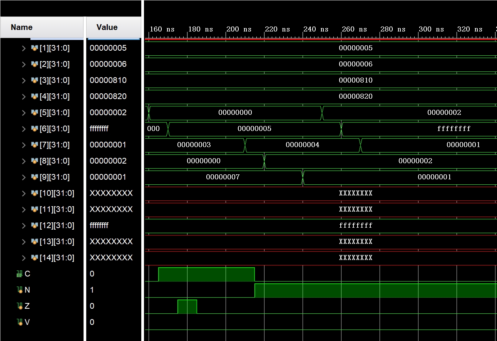
     
     At 260ns, the output of **MVN** instruction is shown in R6. At 270ns, the output of **BIC** instruction is shown in R7. These two waveforms are all correct.

     All in all, all the **16 DP Instructions** can be executed correctly.

   - The on-board test figure is

     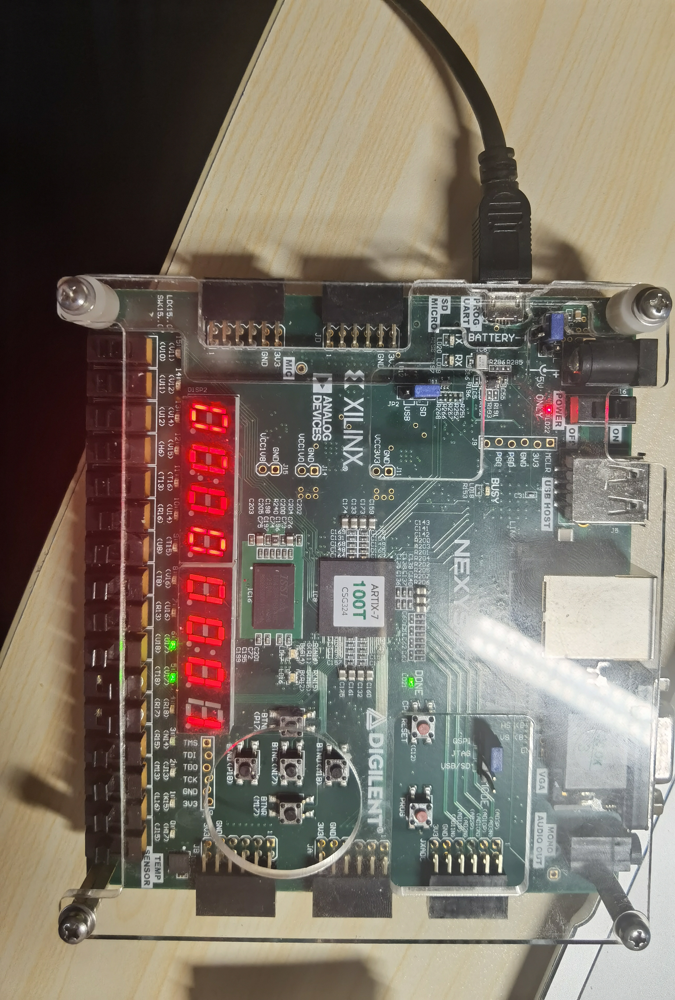 

### 4. A 4-way set associative cache between memory and ARM CPU. 

#### Requirement: 

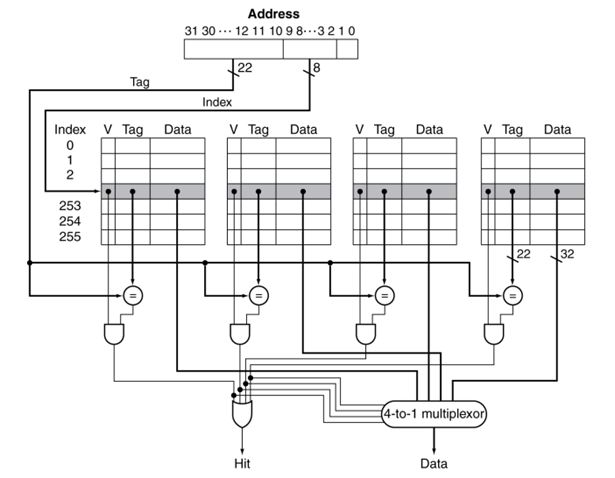

The schematic of a **4-way set associative cache** is shown above. The cache size is **4KB** (256 rows\*4 ways\*4 bytes). The cache uses **write-allocate** and **write-back** scheme. Inserting this cache will further add complexity to the Store and Load instructions. There are 4 situations when accessing the cache:

1. When **read hit**, directly load data from cache to register.
2. When **read miss**, load data from memory to cache, then load data from cache to register.
3. When **write hit**, write to cache only, but set the block dirty, write back to memory when dirty data is replaced. (write-back strategy)
4. When **write miss**, if the block is dirty, write the dirty block to memory, and load the data to replace the cache (write-allocate); if not dirty, directly write to memory, and cache load this data.

#### Implement Workflow:

**TODO: Yupeng Su** 


#### Test & Simulation:

Create your testbench and assembly code to verify these functions in the **simulation waveform**.

### 6. Floating-point Unit

#### Requirement: 

Add a Floating processing unit (FPU) in your pipelined ARM CPU to support simple floating-point processing instructions: 

1. Single Float Addition (**FADD**);
2. Single Float Multiplication (**FMUL**).

#### Implement Workflow:

**FINISHED: Guanqi Peng**

Additionally, you should show the design ideas (such as “How to deal with Not a Number(NaN) in float?”) and the details of your design in your report.

FPU is a 8-state state machine. According to the caculations of floating point numbers, we designed such a state mechine.

|State|Description|Next State|
|-----|-----|-----|
|IDLE|Wait for the FP_Start signal to start calculation.|CHECK (when calculation starts)|
|CHECK|Check NaN conditions and the type of calculation.|IDLE((a) both numbers are NaN. (b) one of the numbers is NaN. (c) one of the numbers is 0); FADD_MATCH(except for the conditions of IDLE, FPUnitOp_in = 0); FMUL_CALCULATE(except for the conditions of IDLE, FPUnitOp_in = 1)|
|FADD_MATCH|Compare exponents and shift smaller mantissa if necessary.|IDLE(the difference between the exponents of the two float numbers is larger than or equal to 23); FADD_CALCULATE(the difference between the exponents of the two float numbers is less than 23)|
|FADD_CALCULATE|Add mantissas.|IDLE(the sign of the two numbers are different and the their magnitude are the same); FADD_NORMAL(except for the conditions of IDLE)|
|FADD_NORMAL|Check the neccssary of mantissa normalize.|IDLE(the sign of the two numbers are different); FADD_LOOP(except for the conditions of IDLE)|
|FADD_LOOP|Normalize mantissa, adjust exponent if necessary and round result.|IDLE(the left bit of the msb of mantissa of the result is 1); FADD_LOOP(the left bit of the msb of mantissa of the result is not 1)|
|FMUL_CALCULATE|Single Float Multiplication.|FMUL_NORMAL|
|FMUL_NORMAL|Check and deal with overflow. |IDLE|

#### Test & Simulation:

The assembly instructions are as below:	

```assembly
LDR R1, constant4;
LDR R2, constant5;
LDR R3, constant6;
LDR R4, constant7;
	
MUL R5, R3, R2;
MUL R6, R3, R4;
MUL R7, R1, R3;
	
DIV R8, R4, R3;
	
constant4 
		DCD 0x42400000;48.0
constant5 
		DCD 0x40A00000;5.0
constant6
		DCD 0x3FA66666;1.3
constant7
		DCD 0x40266666;2.6		
```

The simulation waveform is

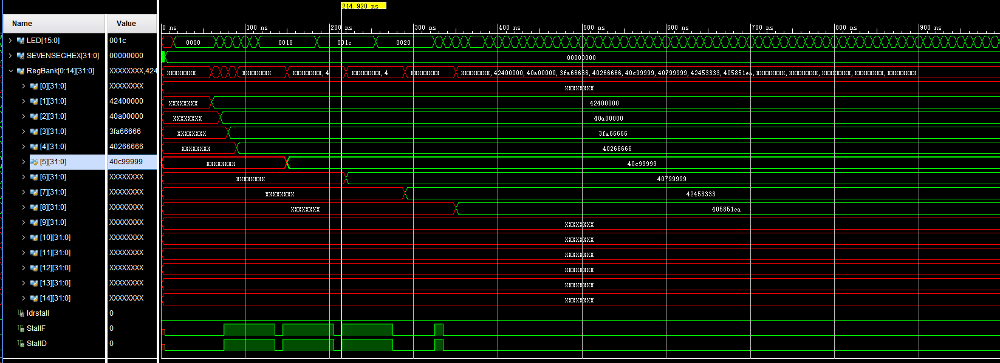

The first three "MUL" instructions are Single Float Addition. The last "DIV" instruction is Single Float Multiplication. The result of the waveform is consistent with the  Calculation results.

When there exist special cases, such as $NaN, \infin, -\infin, 0$, the CPU will process this like below:

The assembly instructions:

```assembly
LDR R1, constant4;
LDR R2, constant5;
LDR R3, constant6;
LDR R4, constant7;
LDR R5, constant8;
		
MUL R6, R1, R2;
MUL R7, R1, R3;
MUL R8, R1, R4;
MUL R9, R1, R5;
	
DIV R6, R1, R2;
DIV R7, R1, R3;
DIV R8, R1, R4;
DIV R9, R1, R5;

constant4 
		DCD 0x3FA66666;1.3
constant5 
		DCD 0x00000000;0.0
constant6
		DCD 0x7F800000;infinite
constant7
		DCD 0xFF800000;Neg infinite
constant8
		DCD 0xFFFFFFFF;NaN
```

The simulation waveform is

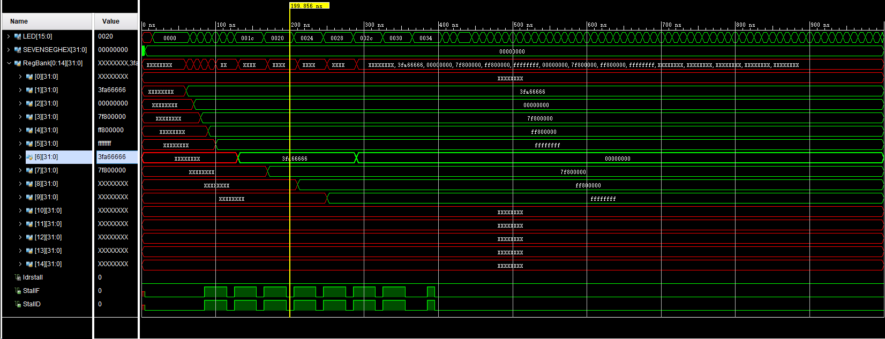

From the waveform we can see that the processor deal with special cases according to the Arm manual.

Dealing with NaN:

1. If one of the number is NaN, the result will be the NaN number.
2. If both the numbers are NaN, there are two conditions. The first one is that one of the number is QNaN and the other is SNaN, then the result will be the QNaN transformed from the SNaN number. The second one is that both numbers are SNaN, then the result will be the QNaN transformed from the first SNaN. 

### 7. RISC-V ISA 

#### Requirement: 

Implement a **single-cycle** CPU core to support simple RISC-V ISA. Your design should support basic instructions in **RV32I** extension (Refer to RISC-V reference manual for more details). **RV32I** is the minimal implementation for a RISC-V CPU, we only need to implement 3 parts of **RV32I**:

1. **Integer computational** instructions;
2. **Load and store** instructions;
3. **Control transfer** instructions. 

#### Implement Workflow:

##### Structure 
The whole sturucture of RISC-V we designed is as follows. 
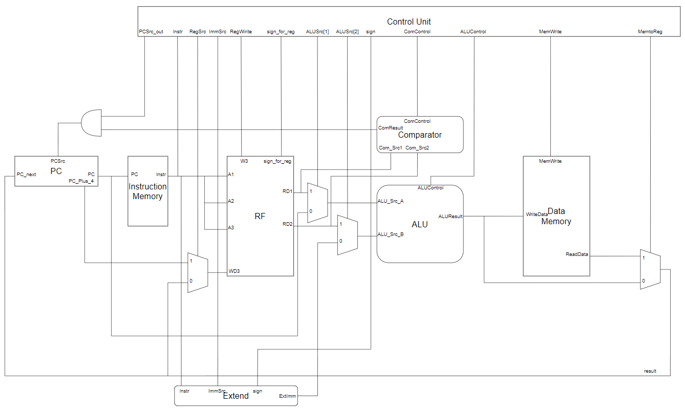

##### Details of each module

###### ControlUnit

The ControlUnit has 11 output control signals in total to control the action of each module and the data flows.

|Signal|Description|Length|
|-----|-----|-----|
|PCSrc_out|To control the next PC.|1-bit|
|ImmSrc|To control the method of extension.|3-bit|
|RegWrite|To control the write action in RF: write a byte, a half word or a word.|2-bit|
|sign_for_reg|Zreo-extend or msb-extend in reg writing|1-bit|
|ALUSrc|To control the inputs of ALU.|1-bit|
|sign|Zero-extend or msb-extend in extend module|1-bit|
|ComControl|To control the output of Comparator according to the instruction.|3-bit|
|ALUControl|To control the output of ALU according to the instruction.|2-bit|
|MemWrite|To control the write action in RF: write a byte, a half word or a word.|2-bit|
|MemtoReg|To select the source of result.|1-bit|

###### ProgramCounter

If PCSrc is 1, the next PC will be next_PC, or the next PC is PC_Plus_4. The next_PC can be either PC+imm or rs1+imm. PC jumps to next_PC only if the PCSrc_out and the output of Comparator are both 1, which is specially designed for jal and jalr instructions.

###### RegisterFile

Only the write instructions in this RISC-V architecture are differnent from these of ARM. WE3 indicates the types of writing: 0b00 for no write, 0b01 for byte write, 0b10 for half-word write and 0b11 for word write. The same design is also in memory writing. The signal sign_for_reg indicates the extension type of writing when RF is not writing a complete word: 1 for msb_extend and 0 for zreo extend.

###### Extend

In the required insyructions set, there are 4 type of instructions having immediate number. Except for I-type instructions, the extensions are all msb-extend. ImmSrc indicates the type of instruction. The signal sign indiactes the type of extension. Only when the core is excuating sltu and sltis instructions, the module excuates zero extension.

###### ALU

ALU takes the jobs of add, sub in all instructions and the comparsions in I-type instructions.

###### Comparator

Comparator takes jobs of comparsions in the B-type instruction to check whether the conditions meet the requirement in brench instructions. According the current instruction, if the brench should be taken, the output of the module will be 1.

#### Test & Simulation:

The assembly instructions are as below:

```assembly
LDR R0, constant1;
LDR R1, constant2;

ADD R2, R1, R0;
SUB R3, R2, R1;
SLT R4, R1, R2;
SLTU R5, R2, R1;
ADDI R6, R0, #11;
SLTI R7, R6, #19;
SLTIU R8, R6, #15;
LB R9, R4, #511;
ADDI R12, R10, #4;
LW R13, R12, #511;
LBU R14, R12, #511;
LHU R15, R12, #511;
SB R4, R15, #2047;
SH R13, R10, #2047;
SW R13, R12, #2047;

ADDI R16, R0, #-4;
ADDI R16, R16, #1;
BNE R0, R16, #-4;

ADDI R17, R0, -4;
BEQ R0, R17, #12;
ADDI R17, R17, #1;
BEQ R0, R0, #-8;

ADDI R18, R0, #0;
BLTU R18, R0, #12;
ADDI R18, R18, #-1;
BEQ R0, R0, #-8;

ADDI R19, R0, #-1;
BGEU R19, R0, #12;
ADDI R19, R19, #1;
BEQ R0, R0, #-8;

LW R20, R4, #2047;
BGE R20, R4, #12;
ADDI R20. R20, #1;
BEQ R0, R0, #-8;

LW R21, R4, #2047;
BLT R4, R21, #12;
ADDI R21, R21, #1;
BEQ R0, R0, #-8;

JAL R22 #4;
SW R22, R12, #2047;
JAL R23 #0;

constant1 
		DCD 0x00000004;
constant2 
		DCD 0x00000008;
```

The simulation waveform is

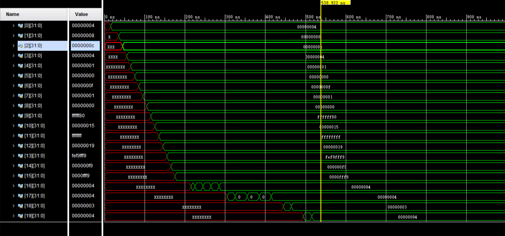

### 8. Advanced Processor (Bonus)

#### Requirement: 

There are some advanced method to further improve the performance of a processor. In this project, you can try to implement some of these functions, test and explain in your report.

1. Dynamic Branch Prediction
2. Multiple-Issue (Superscalar)
3. Out-of-Order Execution
4. Interrupt (Exception handler)
5. ……

**Note: The bonus is hard and takes lots of time, mostly for fun.**