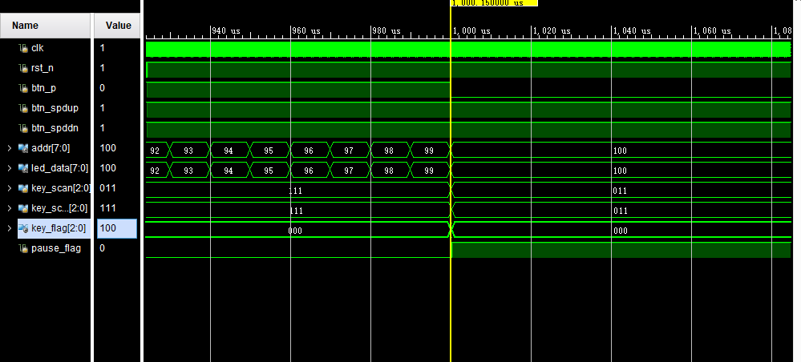
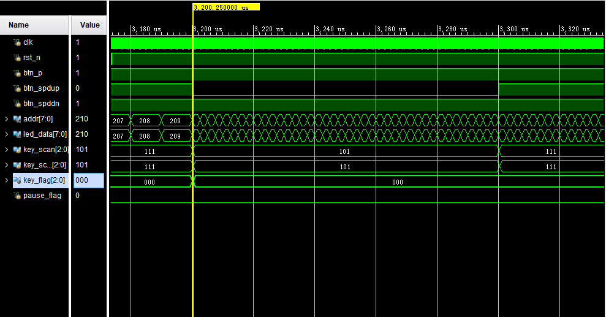
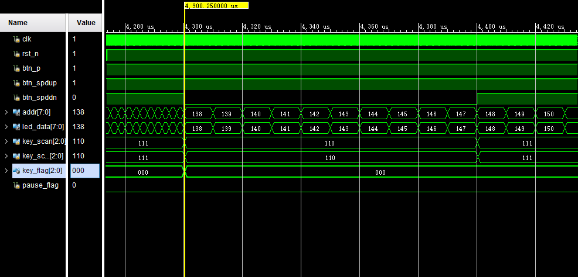
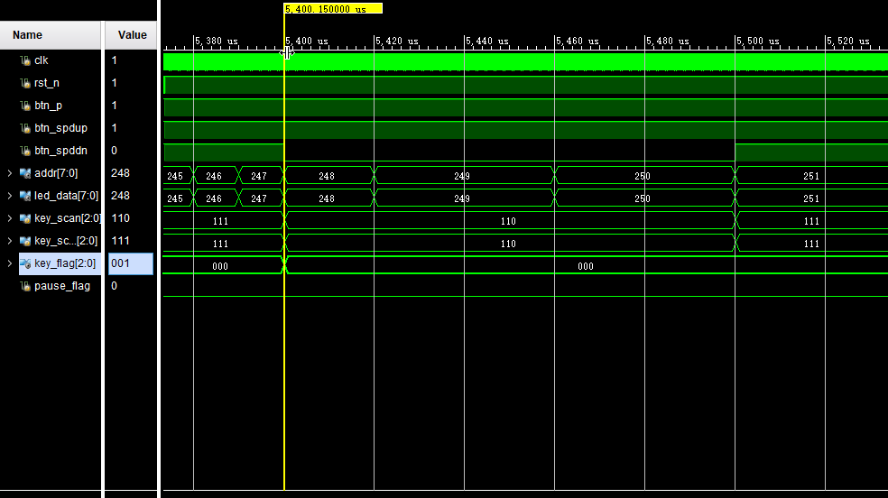
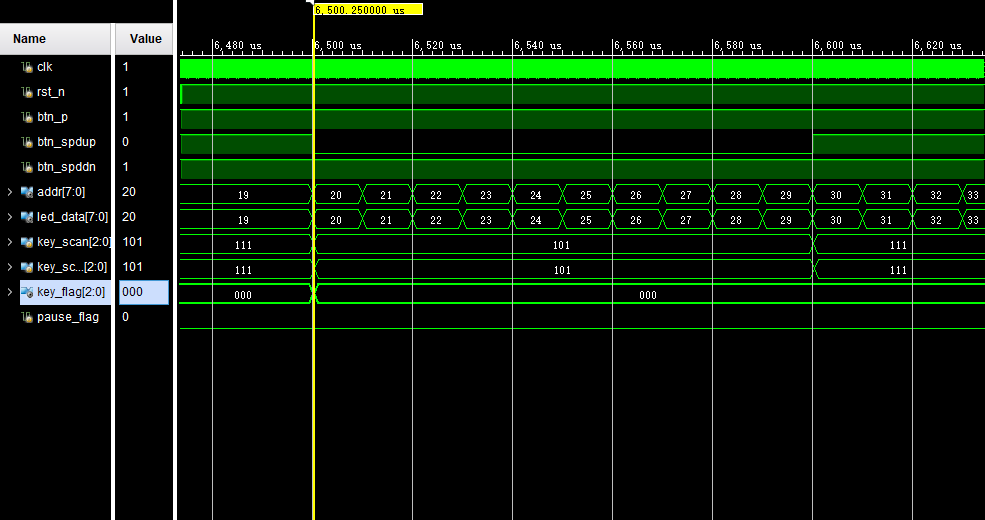
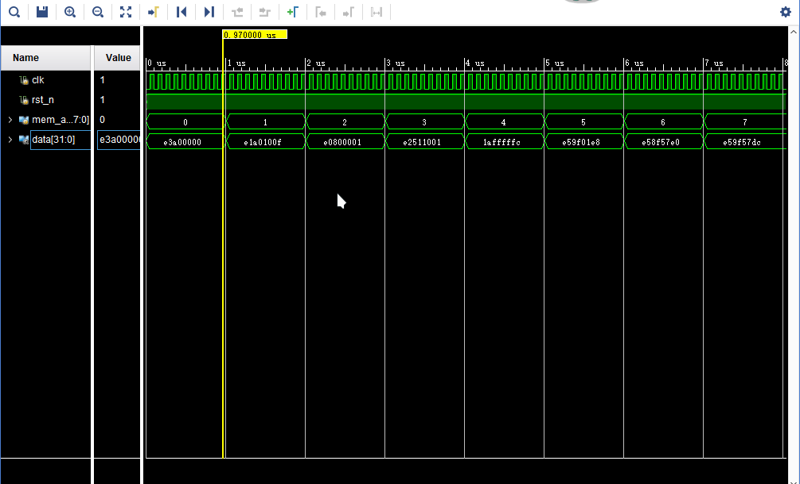
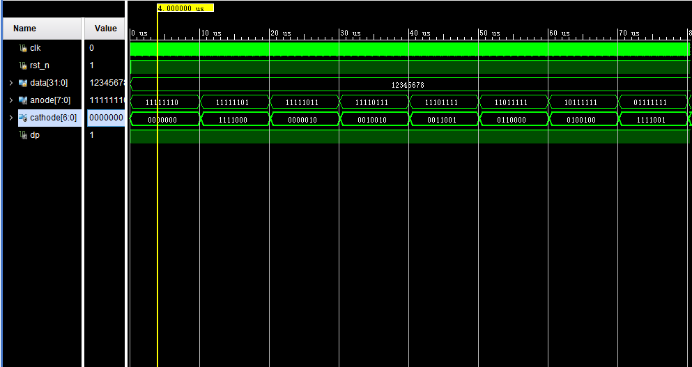
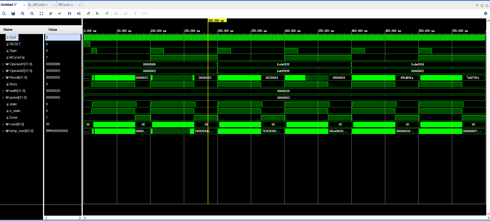

# SME309_MicroprocessorDesign

## Lab1_Report

### Module1_Control.v

#### Module Design

* **按键采样与消抖** ( 功能 1 )
  * 采样率：100Hz ( **10ms** 采样一次 ) 消除了高频信号对于结果的影响。
  * 按键上升沿检测：**key_flag = (~key_scan_r) & (key_scan)**

* **计数器** ( 功能 2 )

  * 保持三个计数器进位计数 ( **cnt, cnt_k, cnt_m** )：1000 * 1000 * 400 
  * 时钟周期：**10ns**。因此，
    * **cnt_m = 400** 时，计时 **4s** 。
    * **cnt_m = 100** 时，计时 **1s** 。
    * **cnt_m = 25** 时，计时 **0.25s** 。
  * 当检测到**暂停按键**按下时，停止/恢复 cnt 计数。

* **速度转换: FSM 实现** ( 功能 3 )

  设置三个状态，**LOW_SPEED NORM_SPEED HIGH_SPEED**

  * 第一段：当前状态与下一状态转换 ( 时序逻辑 )
  * 第二段：下一状态选择 ( 组合逻辑 )
  * 第三段：不同状态进行不同速度的地址输出 ( 时序逻辑 )

#### Testbench & Simulation

```verilog
initial begin
  	// Initialize Inputs
  			rst_n = 0;
        btn_p = 1;
        btn_spdup = 1;
        btn_spddn = 1;

        #10 rst_n = 1;
        #10000000 btn_p = 0;
        #10000 btn_p = 1;
        #10000000 btn_p = 0;
        #10000 btn_p = 1;
        #10000000 btn_spdup = 0;
        #10000 btn_spdup = 1;
        #10000000 btn_spddn = 0;
        #10000 btn_spddn = 1;
        #10000000 btn_spddn = 0;
        #10000 btn_spddn = 1;
        #10000000 btn_spdup = 0;
        #10000 btn_spdup = 1;
end
```

* 01_Pause: 暂停更新地址信息

  

* 02_Pause: 恢复更新地址信息

  

* 03_Spdup: 变为快速模式

  

* 04_Spddn: 恢复默认模式

  

* 05_Spddn: 变为慢速模式

  

* 06_Spdup: 恢复默认模式

  

### Module2_Memory.v

#### Module Design

* 初始化 SRAM ，载入初始指令内存。

* 根据地址寻找内存：

  **data = mem_addr[7] == 1?**

  **DATA_CONST_MEM[mem_addr[6:0]] : INSTR_MEM[mem_addr[6:0]];**

#### Testbench & Simulation

```verilog
initial begin
        // Initialize Inputs
        rst_n = 0;
        mem_addr = 0;

        #10 rst_n = 1;
        #1000 mem_addr = 1;
        #1000 mem_addr = 2;
        #1000 mem_addr = 3;
        #1000 mem_addr = 4;
        #1000 mem_addr = 5;
        #1000 mem_addr = 6;
        #1000 mem_addr = 7;
    end
```



### Module3_SegDisplay.v

#### Module Design

* 计数器：**100_000 * 10 ns = 1 ms**
* 位选信号，1 ms 移动一位。
* 段选信号，根据当前位置选择相应数据显示。

#### Testbench & Simulation

```verilog
initial begin
        // Initialize Inputs
        rst_n = 0;
        data = 32'h12345678;
        #10 rst_n = 1;
    end
```



## Lab2_Report

### Principle

### Testbench & Simulation

```verilog
module Wrapper_tb;
	reg [6:0] DIP;
	reg RESET,CLK;
	wire [15:0] LED;
	wire [31:0] SEVENSEGHEX;
	Wrapper wrapper1 (DIP,LED,SEVENSEGHEX,RESET,CLK); 
	initial begin
		DIP = 6'b001100;
		CLK = 0;
		RESET = 0;
		#10
		RESET = 1;
		#10
		RESET = 0;
		#8000
		$finish;
	end
    always #5 CLK = ~CLK;
endmodule
```

## Lab3_Report

### Module_MyCycle

#### Testbench & Simulation




